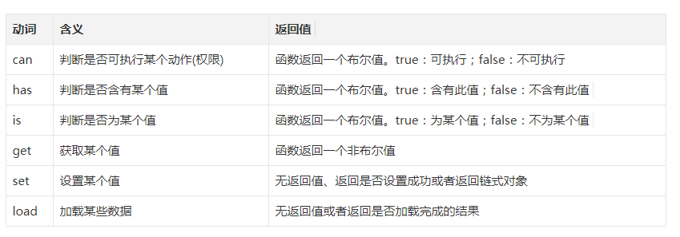

> [前端小团队建设--spademan](https://segmentfault.com/a/1190000016445088)

> [为什么文件名要小写？--阮一峰](http://www.ruanyifeng.com/blog/2017/02/filename-should-be-lowercase.html)

### 什么是前端开发规范
### 为什么要使用前端开发规范
### 怎么使用前端开发规范

#### 一、命名规范（语义化优先原则）
1. 文件

- 对于没有特殊约定的文件夹或文件，统一使用**let+小写字母+连线词**

- 对于约定俗称的，不会产生歧义的单词才可以使用*缩写*

eg：

    文件夹/文件名：dev-specification

2. js中的变量

- 对于变量，统一使用**小驼峰+名词或形容词前缀**

- 对于常量，统一使用**const+大写字母+下划线**

- 对于函数，分为普通函数，构造函数（语法糖--类）
 
 1）对于普通函数，统一使用**小驼峰+动词前缀**
 
动词前缀参考
 （图片来源于 [前端小团队建设--spademan](https://segmentfault.com/a/1190000016445088)）
 
 
 
  2）对于构造函数（语法糖--类），统一使用**大驼峰**
  
  - **注意** 关于构造函数（语法糖--类）中的属性和方法的命名规范
  
  a.对于公共属性和方法，跟变量和普通函数的命名一样
  
  b.对于私有属性和方法，前缀为_(下划线)，后面跟公共属性和方法一样的命名方式
  
  eg:
   
    let totalAmount = 100;  //变量
    
    const MAX_COUNT = 10;    //常量
    
    //普通函数
    function canRead(){}
    
    let handleOnClick = ()=>{}
    
    //构造函数（语法糖--类）
     function Person(){}
              
     class Person{
        // 公共属性
        let publicName = "person"
        //公共方法
        getName(){}
        //私有属性
        let _privateName = "Peter"
        //私有方法
        _setName(){}
     }
 
3. css的class、id

- 对于class，同一使用BEM模式进行命名，统一使用**B__E--M**

- 对于B,E,M的命名，统一使用**小写字母+连线符**

1）B--block：块，代表了更高级别的抽象或组件，本身有意义

2）E--Element:元素，代表 block 的后代，语义化的关键，用于形成一个完整的 block 的整体

3）M--Modifier：修饰符，代表 block 的不同状态或不同版本，来改变外观或行为

- 对于参与样式的id命名，统一使用**小驼峰**

- 对于用于给js调用的钩子的id命名，统一使用**js__+小驼峰**

eg：

    class = "side-menu"
    class = "side-menu__input"
    class = "sile-menu__input--disabled"
    id = "nextStep"
    id = "js__hook"
    
4.注释（遵循迫不得已用注释原则，避免滥用垃圾注释）

- 对于html注释，统一使用 <!--注释内容-->
- 对于css和js单行注释，统一使用 //注释内容
- 对于css和js多行注释，统一使用 /** *注释内容 */
- 对于函数，统一使用/** *@xxxx */

        
html注释
 <!--html注释内容-->
        
        //css和js单行注释内容
        .side-menu__input--disabled{
        
        }
        
        
        /**
        *css和js多行注释内容
        *css和js多行注释内容
        */
        .side-menu__input--disabled{
                 
        }
        
         /**
         *@desc: 函数功能描述
         *@params: {类型}
         *@return: {类型}
         */
        
        function introduceFunctionNote(){}
        
         
